# Sentinel screenshots -- v2

Captured 2026-09-05 against a locally running instance (`uv run sentinel serve` on
`http://127.0.0.1:8000`, frontend on `http://localhost:5173`), after the product-trust fix pass:
world labeling (`Backtest:` nav prefixes + the historical-simulation banner), the re-seeded demo
plan (real supervisor decisions instead of "Approved / 0 decisions"), the honest 404 for
establishments outside a fold's population, run-labeled numbers, the score + history-factor
sentence on each Today row, consolidated disclaimers, and the grouped/singleton split on Field
Plan.

Full-page captures, one PNG per page, at 1440px viewport width.

## Today (`/`)

The live, operational landing page. Each row now shows a score and a concrete history-factor
sentence next to the reason, not just the generic "ranked highly enough" sentence alone.

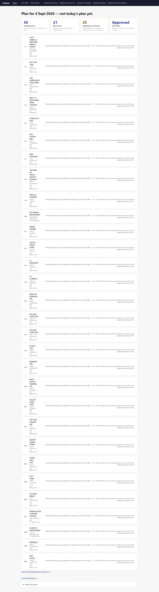

## Field Plan (`/geographic-plan`)

Genuinely grouped work areas and standalone establishments are now visually separated, instead of
18+ near-identical one-establishment card sections.

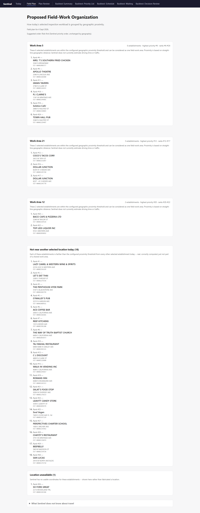

## Plan Review (`/plan-review`)

The re-seeded demo state: "Approved" now comes with 5 real supervisor decisions (3 deferred, 1
cancelled, 1 reordered) instead of "Approved" next to "0 decisions recorded."

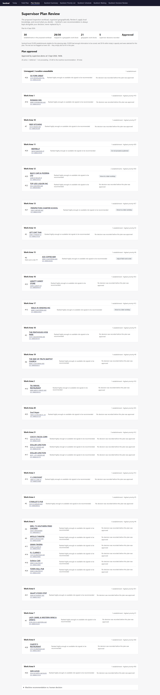

## Backtest Summary (`/plan`)

The historical-backtest overview. Carries the `Historical simulation -- Apr-Jun 2026. Not a
current plan.` banner and states the fold/k-level next to the summary numbers.

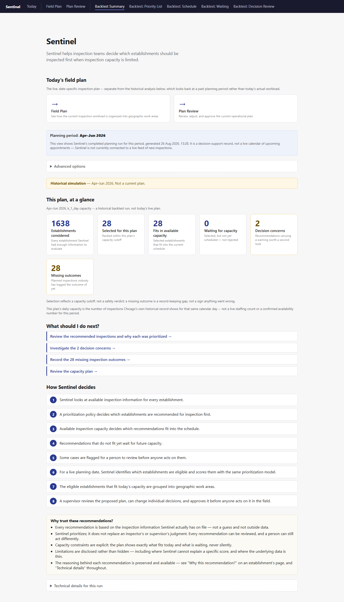

## Backtest: Priority List (`/recommendations`)

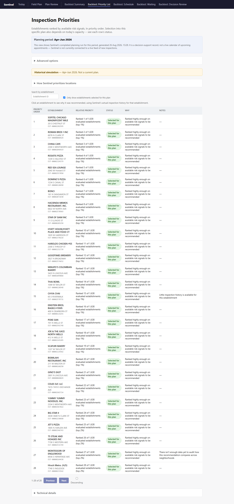

## Backtest: Schedule (`/schedule`)

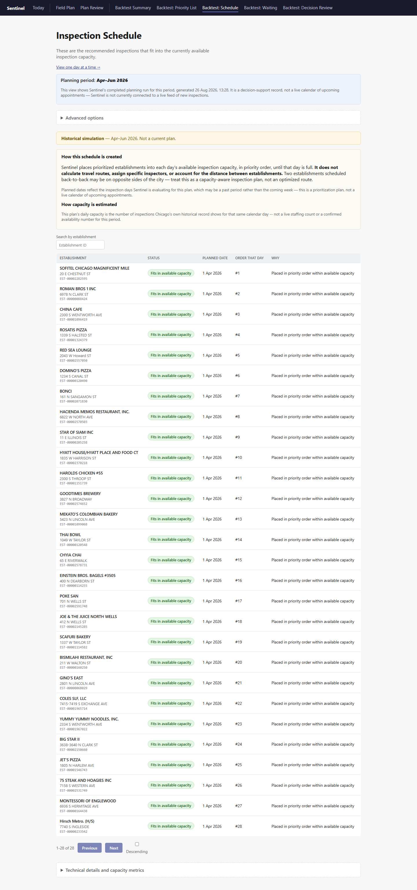

## Backtest: Schedule -- single day (`/schedule/day`)

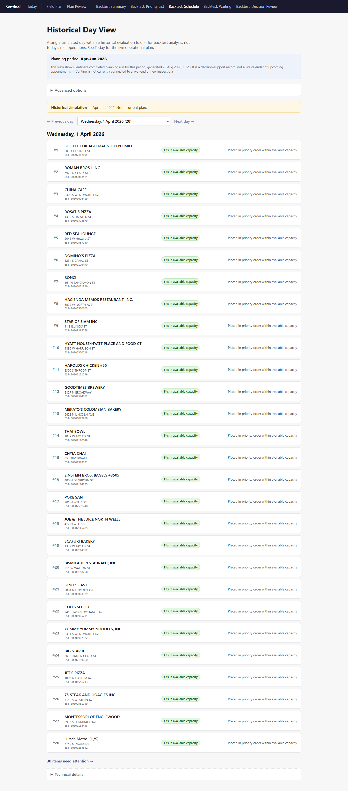

## Backtest: Waiting (`/backlog`)

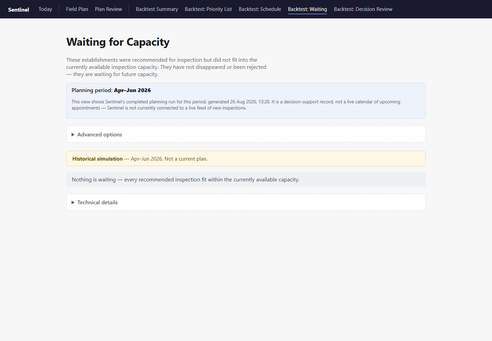

## Backtest: Decision Review (`/review`)

Renamed from the ambiguous "Needs Attention" (which collided with Today's own "Awaiting your
decision" card) to make explicit this is the historical-backtest review queue.

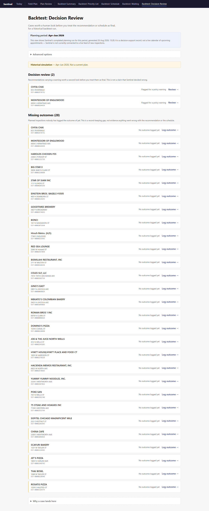

## Establishment detail -- live plan (`/plan/establishments/:id`)

Reached by clicking an establishment from Field Plan.

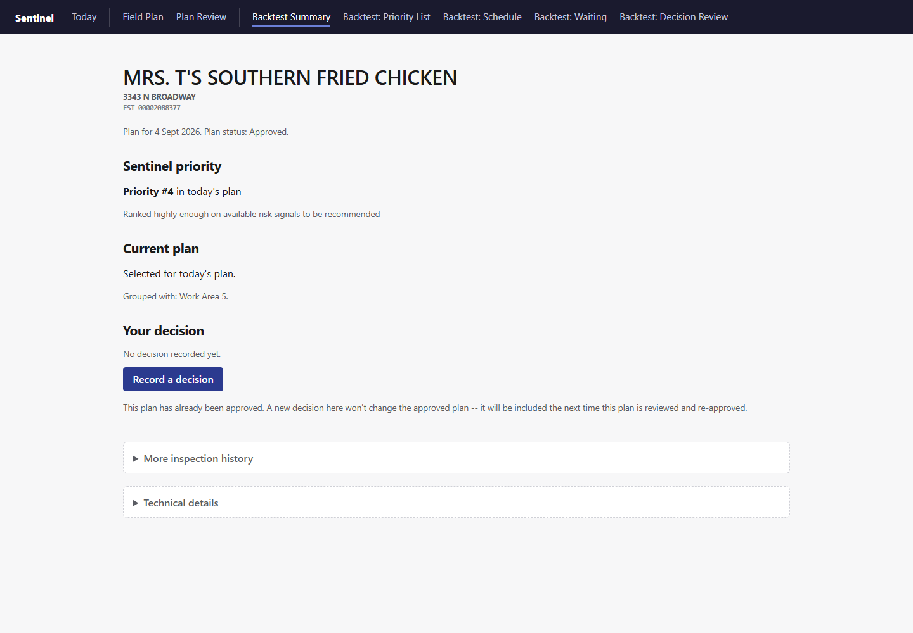

## Establishment detail -- historical backtest (`/establishments/:id`)

Reached by clicking an establishment from Backtest: Priority List. Shows the full seven-step
journey plus the honest 404 explanation (see `EstablishmentDetailPage.tsx`) for establishments
outside a fold's own population.

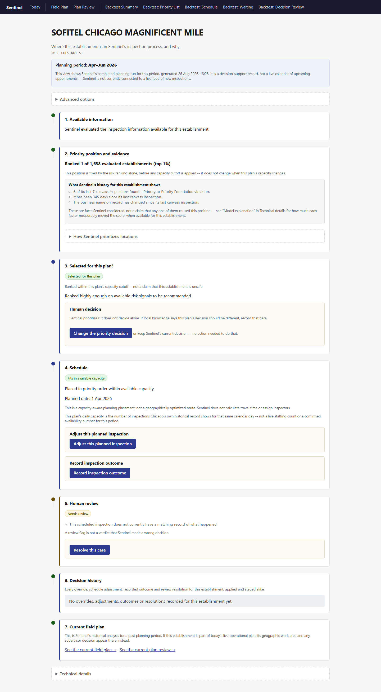
